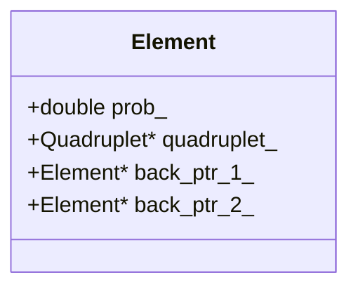
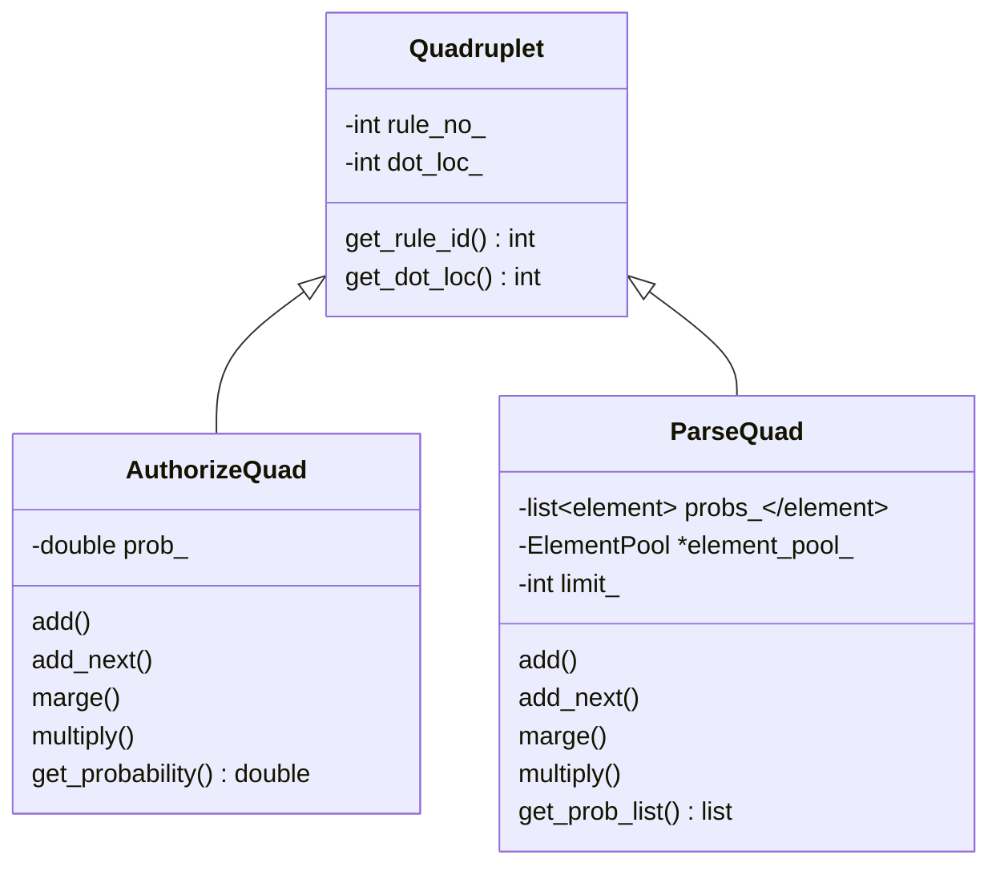
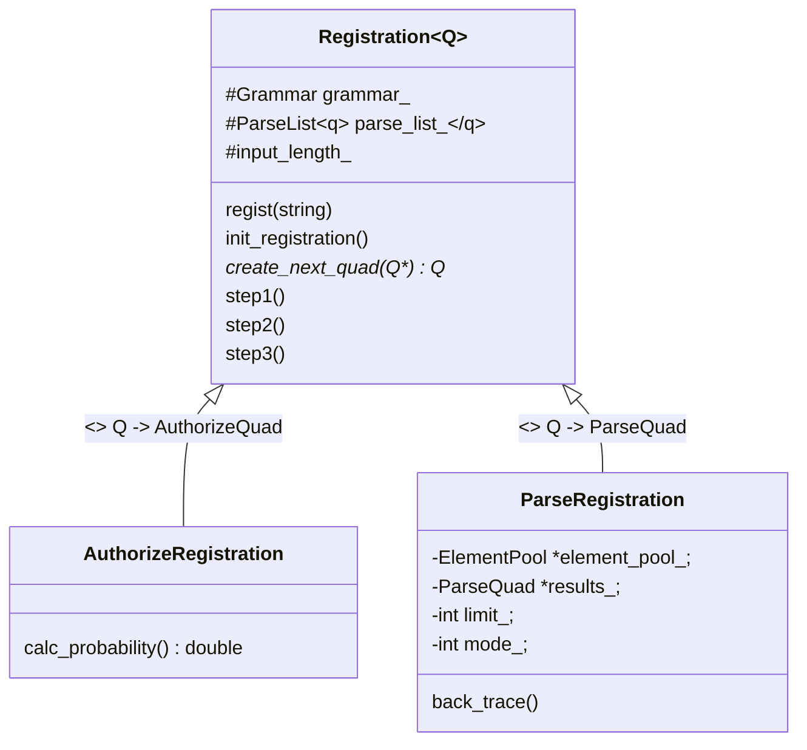
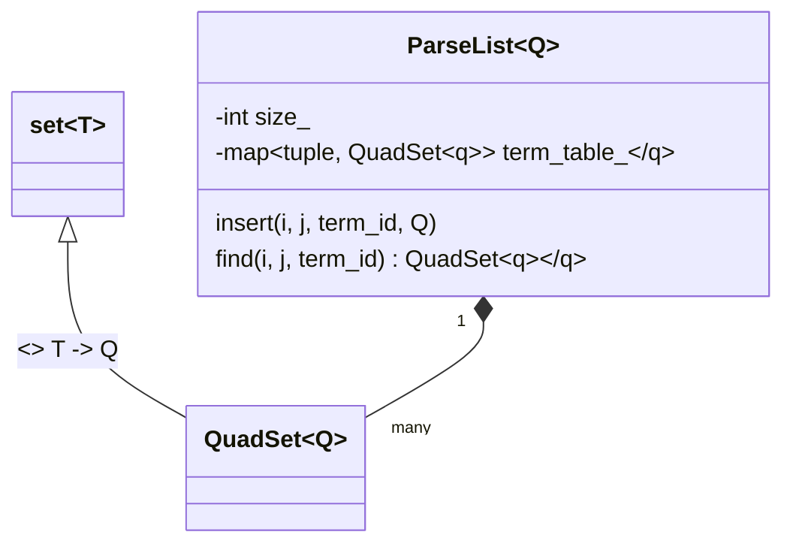

```mermaid
classDiagram
    class Element {
        +double prob_
        +Quadruplet* quadruplet_
        +Element* back_ptr_1_
        +Element* back_ptr_2_
    }

```

```mermaid
classDiagram
    class Quadruplet {
        get_rule_id() int
        get_dot_loc() int
        -int rule_no_
        -int dot_loc_
    }

    Quadruplet <|-- AuthorizeQuad
    class AuthorizeQuad {
        add()
        add_next()
        marge()
        multiply()
        get_probability() double
        -double prob_
    }


    Quadruplet <|-- ParseQuad
    class ParseQuad {
        add()
        add_next()
        marge()
        multiply()
        get_prob_list() list
        -list<Element *> probs_
        -ElementPool *element_pool_
        -int limit_
    }
```

```mermaid
classDiagram
    class Registration~Q~ {
        regist(string)
        init_registration()
        create_next_quad(Q*) Q*
        step1()
        step2()
        step3()
        #Grammar grammar_
        #ParseList<Q> parse_list_
        #input_length_
    }
    
    Registration~Q~ <|-- AuthorizeRegistration : <<bind>> Q -> AuthorizeQuad
    class AuthorizeRegistration {
        calc_probability() double
    }


    Registration~Q~ <|-- ParseRegistration : <<bind>> Q -> ParseQuad
    class ParseRegistration {
        back_trace()
        -ElementPool *element_pool_;
        -ParseQuad *results_;
        -int limit_;
        -int mode_;
    }
```

```mermaid
classDiagram
    class ParseList~Q~ {
        insert(i, j, term_id, Q) 
        find(i, j, term_id) QuadSet<Q> 
        -int size_
        -map~tuple<i, j, term_id>, QuadSet<Q>~ term_table_
    }

    set~T~ <|-- QuadSet~Q~ : <<bind>> T -> Q
    ParseList~Q~ "1" *-- "many" QuadSet~Q~
```
